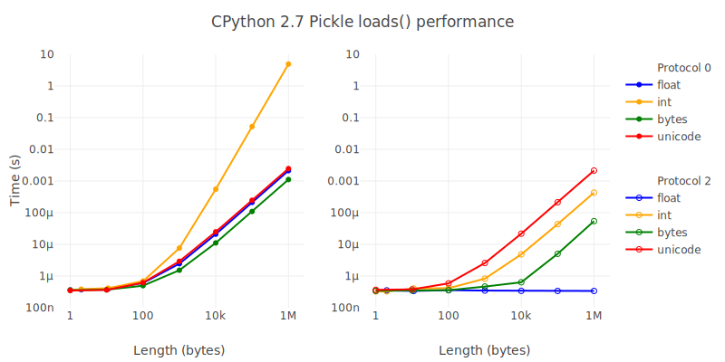
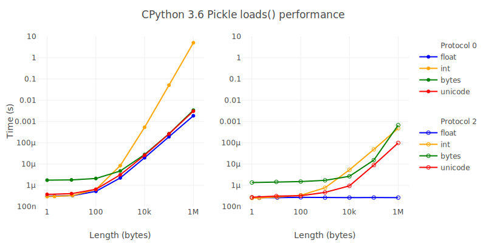

# Fuzzing Python's pickle module

Can Python's `pickle` module be used safely? Even if the commonly cited code
execution attacks are mitigated (with `find_class()`) what attacks remain?

## Pickle

[Pickle] is a serialisation format for Python objects. It's widely regarded
as dangerous to unpickle data from any untrusted source. The Python
documentation warns

[pickle]: https://docs.python.org/3/library/pickle.html
[how pickle works in python]: https://rushter.com/blog/pickle-serialization-internals/

> The pickle module is not secure against erroneous or maliciously
> constructed data. Never unpickle data received from an untrusted
> or unauthenticated source.

The documentation provides a trivial proof of concept

```python
b"cos\nsystem\n(S'echo hello world'\ntR."
```

When this string is passed to `pickle.loads` Python will import the `os`
module, and execute the command `echo hello world`.

This particular example relies on `os` being available as a global variable.
Other examples use different global variables. As documented in
[Restricting Globals] these can be mitigated by filtering (or eliminating)
the global variables made available to the unpickler. Overriding
`pickle.Unpickler.find_class()`, or setting it to `None` can achieve this.
For example

[restricting globals]: https://docs.python.org/3/library/pickle.html#restricting-globals

```python
class RestrictedUnpickler(pickle.Unpickler):

    def find_class(self, module, name):
        # Only allow safe classes from builtins.
        if module == "builtins" and name in safe_builtins:
            return getattr(builtins, name)
        # Forbid everything else.
        raise pickle.UnpicklingError("global '%s.%s' is forbidden" %
                                     (module, name))
```

Even with this mitigation though, pickle cannot be considered safe. Quoting
[PEP 307: Security Issues]

> nobody has ever done the necessary, extensive, code audit to prove that unpickling untrusted pickles cannot invoke unwanted code

[PEP 307: Security Issues]: https://www.python.org/dev/peps/pep-0307/#security-issues

This repository represents a small effort to bridge this gap.

## Other attacks

Other attacks are likely to be possible using the Pickle protocol

### Denial of service

#### Malformed values

Unpickling arbitrary pickles can raise a variety of Python exceptions. The following
have been found so far

- pickle.UnpicklingError
- AttributeError
- EOFError
- ImportError
- IndexError
- KeyError
- MemoryError
- NameError
- struct.error
- SyntaxError
- TypeError
- UnicodeError
- ValueError

If any of these exceptions are unhandled then the Python process as a whole
will usually terminate.

#### Large objects

The pickle protocol allows large objects to be pickled (and hence) unpickled
in chunks. From [PEP-307: Pickling of large lists and dicts]

> Protocol 1 pickles large lists and dicts "in one piece", which minimizes
> pickle size, but requires that unpickling create a temp object as large as
> the object being unpickled. Part of the protocol 2 changes break large
> lists and dicts into pieces of no more than 1000 elements each, so that
> unpickling needn't create a temp object larger than needed to hold 1000
> elements.

[PEP-307: Pickling of large lists and dicts]: https://www.python.org/dev/peps/pep-0307/#pickling-of-large-lists-and-dicts

There does not appear to be anything in current implementations
that enforces this. Hence a crafted payload could cause excessive memory
allocation during unpickling.

#### Billion laughs

Since Pickle allows references between objects, it is possible to construct
[billion laughs attack] payloads. A pickle of a few hundred bytes can result
in data structures containing billions of items. If the payload is
successfully deserialised then further processing (e.g. serializing to JSON,
writing `repr()` to a log) will cause excessive memory & CPU consumption.
If the payload contains a sufficient number of references then the operating
System will usually kill the Python process for exceeding resource limits.

[billion laughs attack]: https://en.wikipedia.org/wiki/Billion_laughs_attack

```python
>>> a = ['lol']*10
>>> a
['lol', 'lol', 'lol', 'lol', 'lol', 'lol', 'lol', 'lol', 'lol', 'lol']
>>> b = [a,a,a,a,a,a,a,a,a,a]
>>> c = [b,b,b,b,b,b,b,b,b,b]
>>> d = [c,c,c,c,c,c,c,c,c,c]
>>> e = [d,d,d,d,d,d,d,d,d,d]
>>> f = [e,e,e,e,e,e,e,e,e,e]
>>> g = [f,f,f,f,f,f,f,f,f,f]
>>> h = [g,g,g,g,g,g,g,g,g,g]
>>> i = [h,h,h,h,h,h,h,h,h,h]
>>> j = [i,i,i,i,i,i,i,i,i,i]
>>> len(j)
10
>>> 10**10
10000000000
>>> pickle.dump(j, open('billion-laughs.pkl1', 'wb'))
>>> pickle.dump(j, open('billion-laughs.pkl2', 'wb'), protocol=2)
```

#### Protocol downgrades

In protocols 0 and 1 most variable length values are pickled as a new-line
terminated, ASCII string. This includes (long) integers. `pickletools`
documentation notes that

> LONG takes time quadratic in the number of digits when unpickling
> (this is simply due to the nature of decimal->binary conversion).
> Proto 2 added linear-time (in C; still quadratic-time in Python) LONG1
> and LONG4 opcodes

The comment (commit [bf2674], 28 Jan 2003) about quadratic runtime in `LONG1`
and `LONG2` appears to be out of date. A subsequent comment (commit [fdc034],
2 Feb 2003) notes

```python
def decode_long(data):
    ...
    n = long(ashex, 16) # quadratic time before Python 2.3; linear now
```

However nothing in the `Unpickler` implementation enforces the use of `LONG1`
and `LONG2`. Hence an attacker can simply avoid using them in order to magnify
the impact of any DOS.

[bf2674]: https://github.com/python/cpython/commit/bf2674be0e95787cdeb154091b7377e30b2827bf
[fdc034]: https://github.com/python/cpython/commit/fdc03462b3e0796ae6474da6f0f9844773d1da8f

Benchmarks of float, integer, byte string and text string for payloads of 1
Byte to 1 MByte show protocol 0 op-codes are significantly slow to deserialize.
An integer can take 10000 times longer to decode if the `LONG` op-code is used.




## Other considerations

### Bit rot

In addition to the known security issues the Pickle protocol is not formally
documented, or standardised. Pickling of custom classes is tightly
coupled to their implementation. This makes Pickle a poor choice choice for
any long term storage and retrieval. To quote [Don’t use pickle — use Camel]

> Its automatic, magical behavior shackles you to the internals of your
> classes in non-obvious ways. You can’t even easily tell which classes
> are baked forever into your pickles. Once a pickle breaks, figuring out
> why and where and how to fix it is an utter nightmare.
>
> Don’t use `pickle`.

### Stack shenanigans?

The `STOP` opcode terminates unpickling, and returns the topmost stack item.
After this occurs the stack should be empty, that condition is not checked or
enforced.

### Extension Registry

Since protocol 2 Pickle has included 'extension' opcodes. Chosen types may
have their constructor added to the extension registry. When pickled these
constructors will be identified by an integer, instead of the GLOBAL (`c`)
op-code. This mechanism is inherantly opt-in, since the extension registry is
empty by default. An example

```python
>>> import collections, copy_reg, pickle, pickletools
>>> pickletools.optimize(pickle.dumps(collections.OrderedDict(), protocol=2))
'\x80\x02ccollections\nOrderedDict\n]\x85R.'
>>> copy_reg.add_extension('collections', 'OrderedDict', 240)
>>> pickletools.optimize(pickle.dumps(collections.OrderedDict(), protocol=2))
'\x80\x02\x82\xf0]\x85R.'
```

Note that this still requires the REDUCE op-code.

## Further reading

Other pickle payloads based on global objects

- [Dangerous pickles — malicious Python serialization], by Evan Sagaline

        b'c__builtin__\neval\n(Vprint("Bang! From, Evan.")\ntR.'

- [Exploiting misuse of Python's "pickle"], by Nelson Elhage
- [Playing with Python Pickle], by SensePost
- [Sour Pickles], presented at BlackHat 2011 by SensePost

  Requires 4 global variables to be exposed (`globals`, `getattr`, `dict`, `apply`)

        b"c__builtin__globals(tRp100\n0c__builtin__\ngetattr\n(c__builtin__\ndict\nS'get'\ntRp101\n0c__builtin__\napply\n(g101\n(g100\nS'loads'\nltRp102\n(S'cos\\nsystem\\n(S\\'sleep 10\\'\\ntR.'tR"

A grab bag of links, advice etc

- [Don’t use pickle — use Camel], by Eevee
- [Diving into the Python Pickle format], by Pierre-Yves Ritschard
- [How pickle works in Python], by Artem Golubin

[Dangerous pickles — malicious Python serialization]: https://intoli.com/blog/dangerous-pickles/
[Diving into the Python Pickle format]: http://spootnik.org/entries/2014/04/05/diving-into-the-python-pickle-formatt/
[Don’t use pickle — use Camel]: https://eev.ee/release/2015/10/15/dont-use-pickle-use-camel/
[Exploiting misuse of Python's "pickle"]: https://blog.nelhage.com/2011/03/exploiting-pickle/
[How pickle works in Python]: https://rushter.com/blog/pickle-serialization-internals/
[Playing with Python Pickle]: https://sensepost.com/blog/2010/playing-with-python-pickle-%231/
[Sour pickles]: https://media.blackhat.com/bh-us-11/Slaviero/BH_US_11_Slaviero_Sour_Pickles_Slides.pdf
